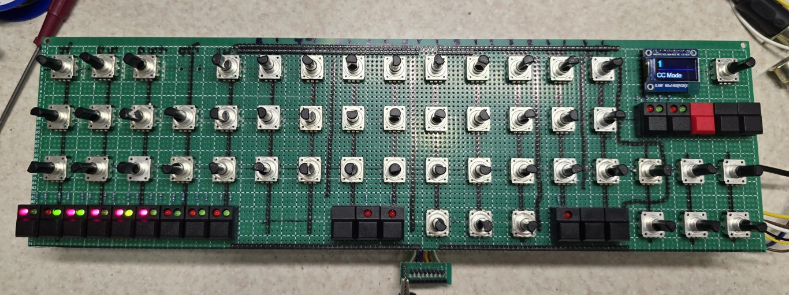

# A Hybrid 8 voice polyphonic synthesizer that utilizes the Teensy Audio Library for the DCOs, LFO's and envelopes and the analogue filters are Shruthi 4Pole Mission based.

I've always wanted to build an oscillator bank that is stable and flexible and has all the usual waveforms of sine, square, triangle, saw and pwm. 

Without a good autoutune the options are limited to Juno 106 style counter DCO's for a polysynth, but seeing how the Teensy Audio Library supports the CS42448 TDM device with 8 outputs. It is possible to build a DCO bank and feed each group of DCOs out of an individual output. These can then feed individual 4 pole analogue filters.

It's early days, but I have an 8 voice, 3 DCO per voice model working with 7 waveforms per DCO, saw, reverse saw, sine, square, triangle, pulse and S&H.

Each DCO has it's own PW and PWM settings and FM depth, interval. The modulation can be from LFO1, Pitch Env and Inverted Pitch Env for FM and LFO2, Pitch Env and Inverted Pitch Env for PWM. These can also be grouped so one set of controls can be used for all 3 DCOs in the voice. Interval is -12 to +12 semitones and this is effectively an octave shift up and down, plus DCOs B & C have a detune. Finally all 3 have a level control as well. There is also a pink and white noise source that can be moved fropm pink - 0 - white on one encoder.

On top of this if you push the wave encoder button for each VCO then you have access to 128 samples of acoustic and electric instruments such as piano etc.

I've made use of the encoder buttons for example, if you push the filter LFO depth encoder it will zero the value and press again it will return to the previous value, same for amplifier LFO depth.  The LFO speed encoders also double as wave selection for the LFOs, so pressing the encoder buttons toggles through the 7 LFO waves.

* Things to fix

Add velocity options, buttons already work, add to envelopes

Add LFO delay of LFO1/LFO2 to the FM, TM and AM sections

Fix centering of some menus
